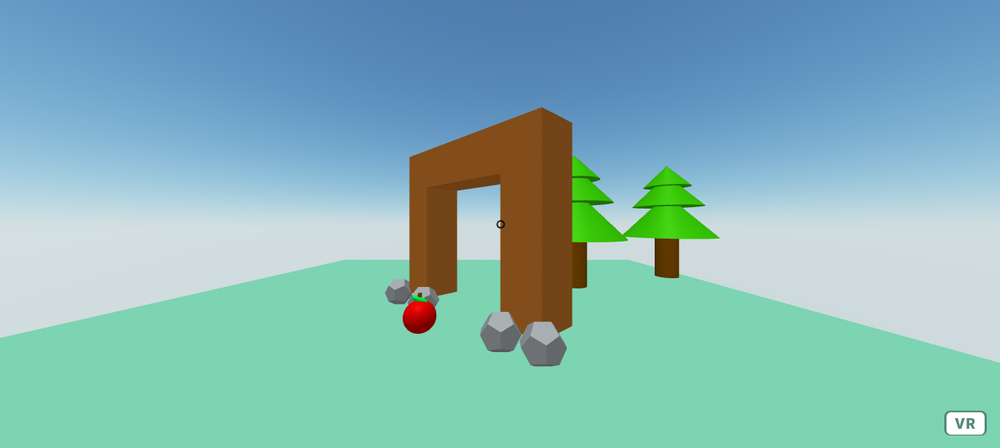

# 🧊 A-Frame Virtual Reality

A simple prototype to test the A-Frame framework.
    
  <!-- License -->
  

> Play on: https://coetus-jd.github.io/a-frame-vr/

## :eyes: Overview

     

## 🏄‍♂️ Quick Start
 1. Clone this repository `git clone https://github.com/coetus-jd/a-frame-vr.git`
 2. Finally open the `index.html` file 😃

## :bricks: This project was built with: 
- [A-Frame](https://aframe.io/)
- [A-Frame Environment Component](https://github.com/supermedium/aframe-environment-component)
